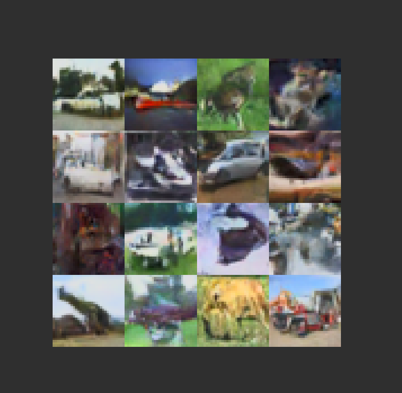

# a-paper-a-week

A repository of paper implementations (in PyTorch and tinygrad) across various domains.

## Week 1: Rectified Flow

- [Rectified Flow README](1-rectified-flow/README.md)

Notes: I think the model needs to train for a little bit longer, probably on 2 GPUs and 30,000 steps instead of 20,000. The sampling was also slightly incorrect, so at some point I'll re-train the model and replace the outputs below with nicer looking images. 

Additionally, I want to try this on the AFHQ database (512x512 images of animal faces) but I think that's a 4-5 hour training run, even on 2 GPUs.  

### Samples

